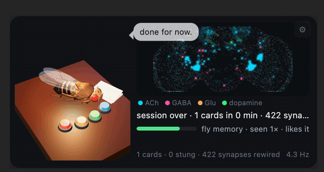

# Anki Fly

A fruit fly that studies with you. It lives in the corner of Anki; its brain is a 9,000-neuron
slice of the real **MaleCNS v1.0** connectome (Janelia FlyEM + Google Research, 2026) running as a
leaky-integrate-and-fire spiking simulation. Your cards are its odors, your answers are its
dopamine, and you can watch the neurons fire.

Full demo video: [docs/anki-fly-demo.mp4](docs/anki-fly-demo.mp4)

The fly sits an exam on your deck:

## What it does

- **Every card is a smell.** The note id picks 6 of 61 olfactory glomeruli; their projection
  neurons fire, ~5% of the Kenyon cells respond (sparse coding, from the real wiring).
- **Your answers are dopamine.** Good/Easy fires the PAM reward neurons; Again fires PPL1
  punishment neurons. The dopamine-gated KC→MBON plasticity rule rewires the fly's synapses, so it
  builds its own memory of your deck. A "fly memory" bar shows how it feels about the current card.
- **Behaviours come from the circuits.** Sugar → MN9 → proboscis extension (5-streak reward),
  looming → giant fiber → escape jump (when you come back), grooming and sleep when you idle.
- **Immersive layer.** Thought bubbles explain what just happened in the brain; hover the brain to
  see which neuron and neurotransmitter is under the cursor; fly facts while you think.
- **Fly Exam** (Tools → Anki Fly, or `Ctrl+Shift+E`): pick decks/tags and the fly sits an exam on
  those cards. The score is a Monte-Carlo readout of Anki's own FSRS retrievability (the real
  gauge), with the fly's connectome memory blended in at 25% (the fun part), plus true retention,
  again rate, stability-per-minute, consistency and backlog from your review log, and a diagnosis
  with the learning-science reason for each flag.
- **Sync with your history.** Tools → Anki Fly → Sync replays your whole review log into the fly's
  synapses (aggregated per note), so a year of Anki becomes a year of fly memories in seconds.
- **Minimize / hide.** Hover the widget for `–` (collapse to a tiny fly) and `×` (hide for this
  session). `Ctrl+Shift+F` toggles it. Options in the add-on config.

## Install (for testing)

    ./build.sh                       # -> dist/anki-fly.ankiaddon
    # Anki → Tools → Add-ons → Install from file… → dist/anki-fly.ankiaddon → restart Anki

Or symlink `addon/` into `~/Library/Application Support/Anki2/addons21/anki_fly`.

Requires Anki ≥ 25.02 (tested on 26.09.2, macOS). No Python dependencies; the simulation runs in
JavaScript inside Anki's webview.

## Development

    python3 tools/extract_subgraph.py   # rebuilds addon/web/data from neuprint-cns.janelia.org (public, no token)
    node tests/test_sim.mjs             # LIF engine unit tests + real-subgraph sanity
    node tests/test_circuits.mjs        # sugar→MN9, loom→GF, odor→sparse KC, dopamine plasticity, no runaway
    <venv with aqt>/bin/python tests/test_addon.py   # offscreen Anki: hooks, exam data collection
    open addon/web/index.html?dev=1     # standalone widget with event buttons (serve via http for modules)

### Model notes (honest version)

- Dynamics are Shiu et al. 2024 (Nature): τ_m 20 ms, V_rest −52, V_th −45, V_reset −52 mV,
  refractory 2.2 ms, delay 1.8 ms, τ_syn 5 ms, 0.275 mV × synapse count, sign by predicted
  neurotransmitter (ACh +, GABA/Glu −).
- The subcircuit: uniglomerular PNs, all Kenyon cells, APL/DPM, MBONs, PAM/PPL1 DANs, LC4 → DNp01
  (giant fiber), sugar GRNs (LB3) with their 1- and 2-hop interneurons to MN9/MN1/MN6, DNp09, DNg11,
  MDN, DNa01/02, and a 4,000-neuron open-loop silhouette. Edges with ≥ 3 synapses.
- Deviations from a pure whole-brain model, each chosen after testing: dopaminergic/serotonergic/
  octopaminergic neurons have no fast synaptic effect (their effect *is* the plasticity rule);
  APL/DPM output is scaled ×0.5 because they are non-spiking, graded neurons; the antennal-lobe
  excitatory local neurons are excluded because in a LIF model they recruit every glomerulus;
  silhouette neurons receive from the circuit but don't feed back.
- Plasticity: PAM depresses eligible KC→glutamatergic (avoidance) MBON synapses, PPL1 depresses
  KC→GABA/ACh (approach) MBON synapses; eligibility trace 3 s; slow recovery.

## Data & licenses

- MaleCNS v1.0 connectome: CC BY 4.0, Janelia Research Campus / Google Research, via neuPrint.
- Fly body mesh: `flybody` (Turaga Lab / Google DeepMind, Apache-2.0), see `addon/web/vendor/`.
- three.js: MIT. Add-on code: MIT.
