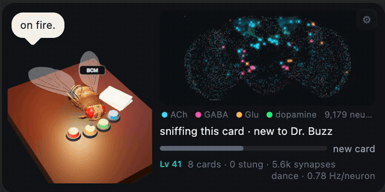
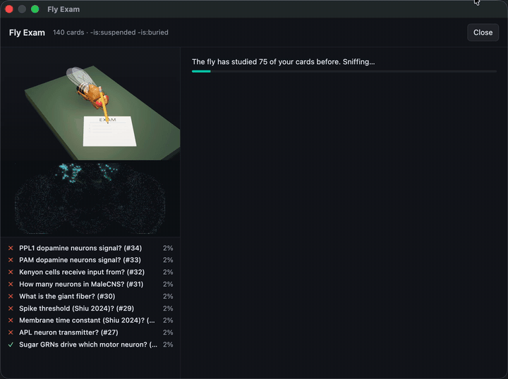
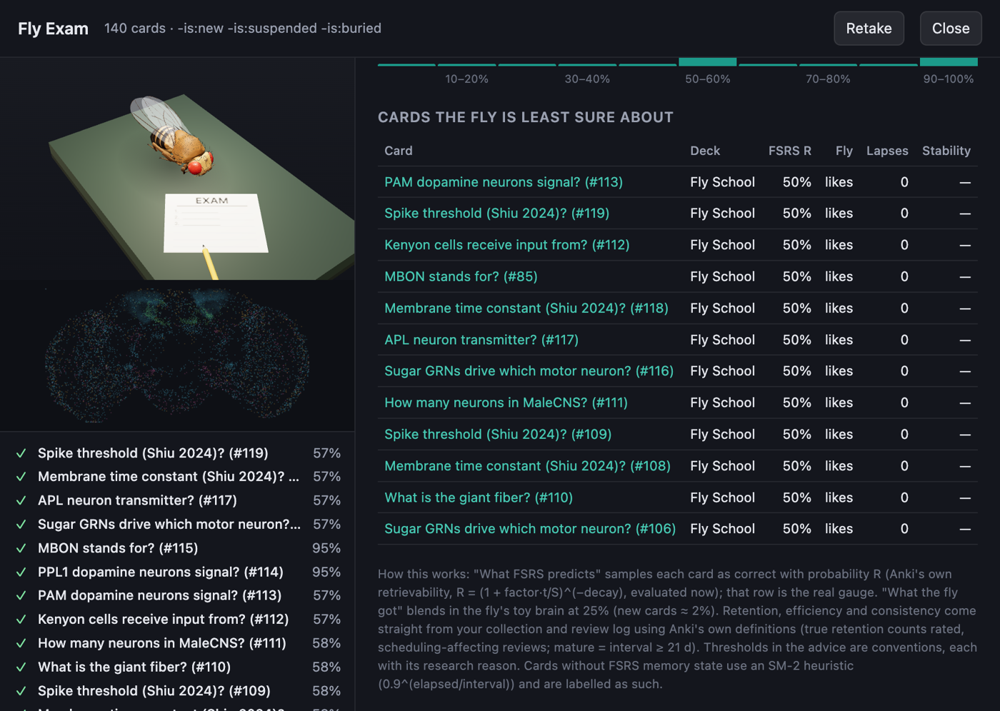
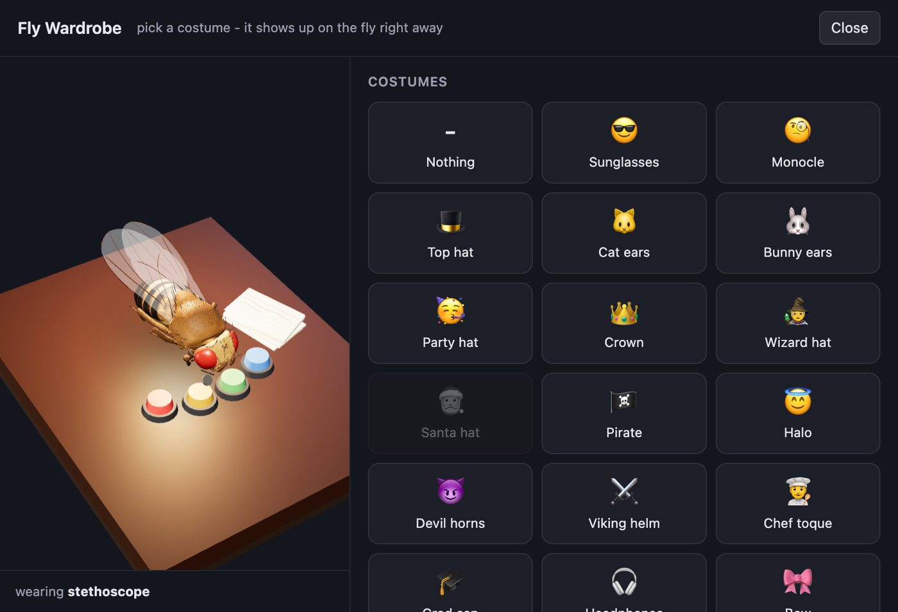
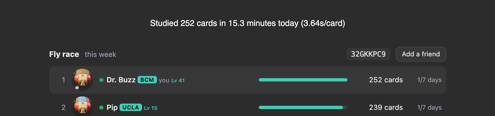
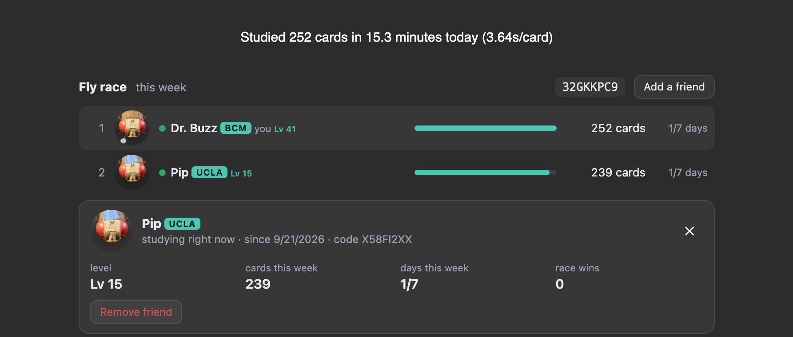

# Drosophil-Anki

A fruit fly with a real brain studies with you in Anki.

The fly in the corner is not a mascot. Its brain is a slice of the fruit fly connectome (MaleCNS v1.0,
Janelia and Google, 2026) running as a live spiking-neuron simulation while you review. Your cards are
its smells, your answers are its dopamine, and you can watch the neurons fire.

**Install**: Anki → Tools → Add-ons → Get Add-ons… → code **`888374074`** → restart Anki.
AnkiWeb page: https://ankiweb.net/shared/info/888374074 · Anki 25.02+ on Mac, Windows, Linux.

## What it does

**A brain, not a mascot**
- Every card is a smell. Its note id activates olfactory neurons; a sparse set of Kenyon cells responds, as in the real wiring.
- Good and Easy fire the reward (PAM) neurons, Again fires the punishment (PPL1) neurons, and the fly's Kenyon-cell → MBON synapses rewire the way a real fly learns. The memory bar shows how it feels about the current card.
- Hover the brain to see which neuron and transmitter is under the cursor.
- **Sync** replays your whole review history into the fly's brain in seconds.
- Two real brains: the male fly runs MaleCNS, the female fly runs the FlyWire connectome.

**A fly with a personality**
- A 3D fly from the flybody anatomical model at a desk with your cards and its own Again / Hard / Good / Easy buttons, which it presses along with you.
- Moods from your session: dances and zoomies on a strong run, a crash-out and a sulk after too many Agains, asleep at its desk if you leave.
- It speaks rarely, on purpose: only for things worth noticing, and only for streaks that are impressive by your own standards.

**Fly Exam** (Ctrl+Shift+E): pick decks and the fly sits an exam on them, pencil in hand. The score is Anki's own FSRS prediction of what you would remember right now, explained in plain words, with true retention, again rate and consistency from your review log, and a short diagnosis with the research reason behind each flag.

**Make it yours**: name your fly, give it a team tag (BCM, UCLA…), level it up with XP from every review, and dress it from a **Wardrobe** of 40 costumes unlocked by studying: hats, sunglasses, cat ears, seasonal outfits, and a medical and language-learner set (stethoscope, scrub cap, head mirror, goggles, surgical mask, language headset, dictionary).

**Fly race**: a weekly leaderboard on Anki's home screen of cards reviewed by you and your friends, each fly's face and costume next to its name, a green dot for who is studying right now. Click a fly for its profile; your own profile has checkboxes for what friends may see, and friends can be removed from theirs. Friends are added by fly code. Only your fly's name, look, level and weekly totals are shared, never cards, decks or individual answers.

**Not distracting**
- Deep Focus (Ctrl+Shift+D) keeps the fly still and silent.
- Minimize it to a tiny fly, resize it (drag the top-left corner), or hide it for the session (Ctrl+Shift+F).
- A gentle "take a break?" when your answers get slower and wronger than at the start of the session, at most every 15 minutes.
- A "to revisit" chip pointing at the cards you keep missing.

Full demo video: [docs/anki-fly-demo.mp4](docs/anki-fly-demo.mp4)

## Development

    ./build.sh                                  # -> dist/anki-fly.ankiaddon (refuses to package without the brain data)
    python3 tools/extract_subgraph.py           # rebuild the male pack from neuprint-cns.janelia.org (public, no token)
    python3 tools/extract_subgraph.py --dataset female
    node tests/test_sim.mjs                     # LIF engine unit tests + real-subgraph sanity
    node tests/test_circuits.mjs                # male pack: sugar→MN9, loom→GF, sparse odor code, plasticity, recovery
    node tests/test_circuits_female.mjs         # the same on the FlyWire pack
    <venv with aqt>/bin/python tests/test_addon.py   # offscreen Anki: hooks, exam data collection
    cd backend && npm test                      # friends server (Cloudflare Worker)

`backend/` is the friends server (Cloudflare Worker + KV). The add-on points at the official deployment
by default; `npx wrangler deploy` publishes your own and `friends_server` in the config selects it.

### Model notes

- Dynamics follow Shiu et al. 2024 (Nature): τ_m 20 ms, V_rest −52, V_th −45, V_reset −52 mV, refractory
  2.2 ms, delay 1.8 ms, τ_syn 5 ms, 0.275 mV × synapse count, sign by predicted transmitter (ACh +, GABA/Glu −).
- Subcircuit: uniglomerular PNs, all Kenyon cells, APL/DPM, MBONs, PAM/PPL1 DANs, LC4 → DNp01 (giant fiber),
  sugar GRNs with their 1- and 2-hop interneurons to MN9/MN1/MN6, walking/grooming/turning descending neurons, and a
  4,000-neuron open-loop silhouette. Edges with ≥ 3 synapses.
- Deliberate deviations, each chosen after testing: neuromodulatory neurons have no fast synaptic effect (their effect
  is the plasticity rule); APL/DPM output is scaled because they are non-spiking, graded neurons; antennal-lobe
  excitatory local neurons are excluded; LC4 is feed-forward; a sustained-loop quench stands in for the adaptation and
  inhibition the subgraph lacks; silhouette neurons never feed back.
- Plasticity: PAM depresses eligible KC→glutamatergic (avoidance) MBON synapses, PPL1 depresses KC→GABA/ACh (approach)
  MBON synapses; 3 s eligibility trace; slow recovery.

## Data and licenses

- MaleCNS v1.0 connectome: CC BY 4.0, Janelia Research Campus / Google Research, via neuPrint.
- FlyWire FAFB v783 connectome (female fly): CC BY-NC 4.0, Dorkenwald et al. 2024 / Schlegel et al. 2024. This
  add-on is free and non-commercial.
- Fly body meshes: flybody (Turaga Lab / Google DeepMind), Apache-2.0. three.js: MIT. Add-on code: MIT.
